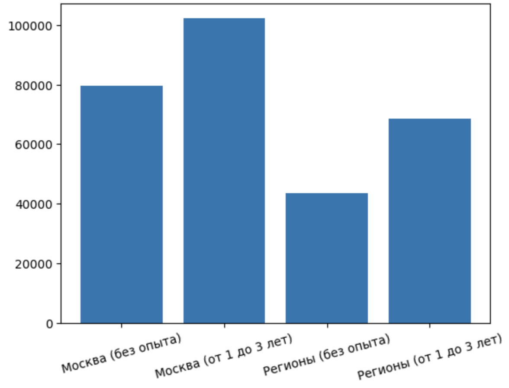

# Анализ вакансий аналитиков на hh.ru

Этот проект выполняет сбор и анализ данных о вакансиях **Data Analyst / Аналитик данных** с сайта [hh.ru](https://hh.ru) через официальное API. Основная цель — сравнить средние зарплаты по регионам (Москва vs регионы) и уровню опыта.

## Что делает скрипт?

1.  **Сбор данных**: Использует API hh.ru для получения вакансий по ключевому запросу "дата аналитик".
2.  **Фильтрация**: Собирает только вакансии с указанным диапазоном зарплаты и опытом работы:
    *   `noExperience` (Нет опыта)
    *   `between1And3` (От 1 года до 3 лет)
3.  **Обработка данных**: Преобразует сырые JSON-данные в удобный формат `pandas.DataFrame`.
4.  **Анализ**: Группирует данные по городу и опыту, чтобы рассчитать среднюю зарплату.
5.  **Визуализация**: Строит столбчатую диаграмму для наглядного сравнения результатов.

## Структура проекта

*   `hh_analyze.ipynb` — основной Jupyter Notebook с кодом.
*   `hh_api_vacancies.csv` — файл с собранными данными (генерируется при запуске).

## Как запустить

1.  Убедитесь, что у вас установлен Python (версия 3.7+).
2.  Установите необходимые зависимости:
    ```bash
    pip install requests pandas matplotlib jupyter
    ```
3.  Запустите Jupyter Notebook:
    ```bash
    jupyter notebook
    ```
4.  Откройте файл `hh_analyze.ipynb` и выполните все ячейки.

> **Важно:** API hh.ru имеет лимиты на количество запросов. Скрипт содержит паузу (`time.sleep(0.5)`) между запросами, чтобы не превысить их.

## Результат

В результате выполнения скрипта вы получите:
*   CSV-файл с данными о вакансиях.
*   График, сравнивающий среднюю зарплату в Москве и регионах для двух категорий опыта.

Пример графика:


## Ограничения

*   Проект собирает данные только для России (`area=113`).
*   Анализ основан на первых нескольких страницах выдачи API.
*   Зарплата считается как среднее значение между `from` и `to`. Если указано только одно значение, оно используется как есть.

## Полезные ссылки

*   [Документация API hh.ru](https://github.com/hhru/api)
